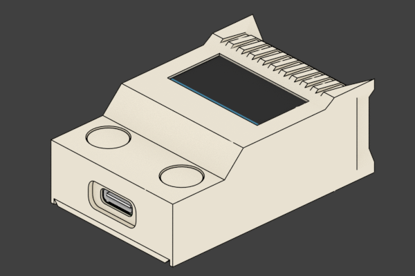
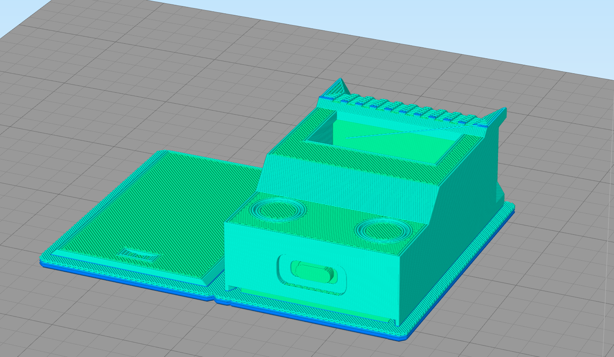
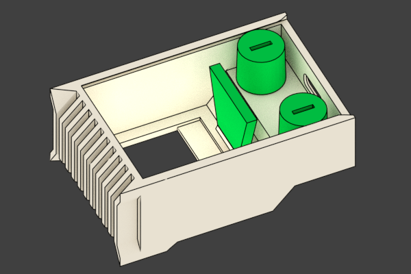
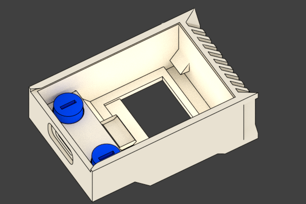
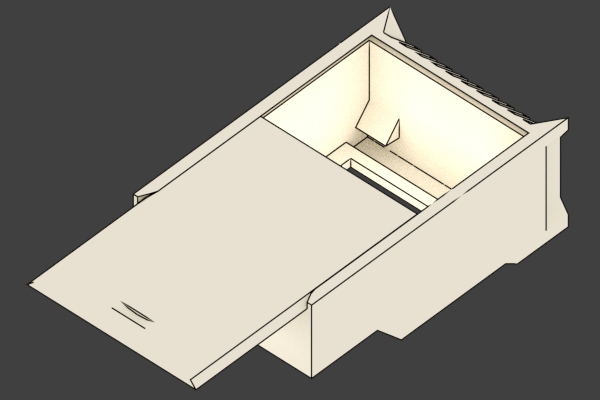

# Monezor Enclosure Solids

This is the menzor 3D printable enclosure.

## Getting Started

The enclosure is designed in [Blender](https://www.blender.org) to ease modification with a free available software package.

---
### Printing
There is a STL file and GCode attached for printing.

#### Short Print Settings: 

	LayerHeight	~0.2
	Support		60 degree
	Outlines	2-3
	Infill 		~30% 
	Raft		advised [ gives better surface finnish ]
	
_the complete list of settings is incuded in monezor\_enclosure\_gcode\_settings.txt_

The finished print should look something like this:

---
### Removing Supports

The print will contain generated support structures from the slicer, further there are three modeled support structures that are marked green below. The trapezoid shaped one can be easily broken out. The two cylindrical shaped support structures have a slot to turn them loose. If turning is not successfull use a small players to remove the support. [ go easy ]

---
### Smoothing out buttons

After removing the support you should see the two buttons. They are printed within the enclosure so they will be stuck after the print. Use a small screw driver to turn them carefully for a few minutes until they become easy to press.

---
### Closing the lid

After positioning the oled screen and the monezor pcb within the enclosure it can be closed by sliding the lid into the bottom.

